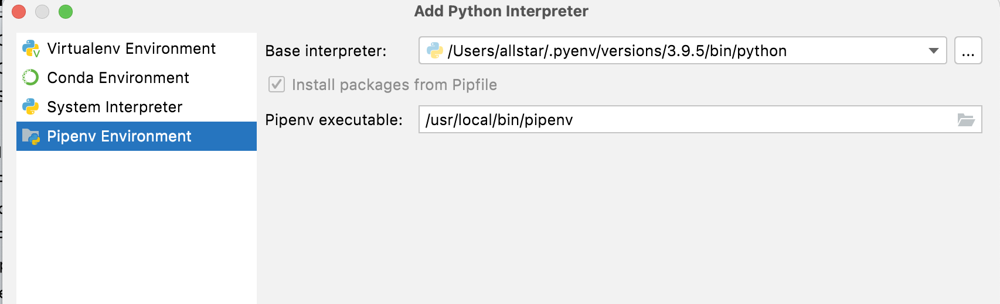

 

  <h3 align="center">Crypto Exchange Listings</h3>

<!-- ABOUT THE PROJECT -->

## About The Project
Receive alerts in a Telegram bot as soon as a new crypto is listed in Coinbase.

The script is working on a raspberry 4 where i installed mongo.

### Built With
* [scrapy](https://scrapy.org/)

(<a href="#top">back to top</a>)

<!-- GETTING STARTED -->

## Getting Started

Create a Telegram bot. A good starting point link : 

* [telegram bot](https://www.youtube.com/watch?v=67SH6tCuyLQ)

Install a mongo server :

* [mongo](https://www.mongodb.com/developer/how-to/mongodb-on-raspberry-pi/)

### Installation PyCharm

Create a pipenv environment 

Then in a terminal :

`cd crypto-exchange-listings`

`pipenv install -r requirements.txt`

## Usage

### Run with PyCharm

Click on Edit configurations

Click the `+` button end then `Add new configuration` and select `python`

 
Then fill run parameters :

### Raspberry conf

copy `settings.py.sample` to `settings.py`
Set : `MONGO_SERVER` and `TELEGRAM_BOT` variables.

There is a script `runner.sh` that will trigger the job. 
Just add a cron that will schedulle de job : 

`0,5,10,15,20,25,30,35,40,45,50,55 * * * * /media/usbdrive/dev/crypto-exchange-listings/exchange-scrappers/runner.sh >> /var/log/crypto-exchange-listings.log`

